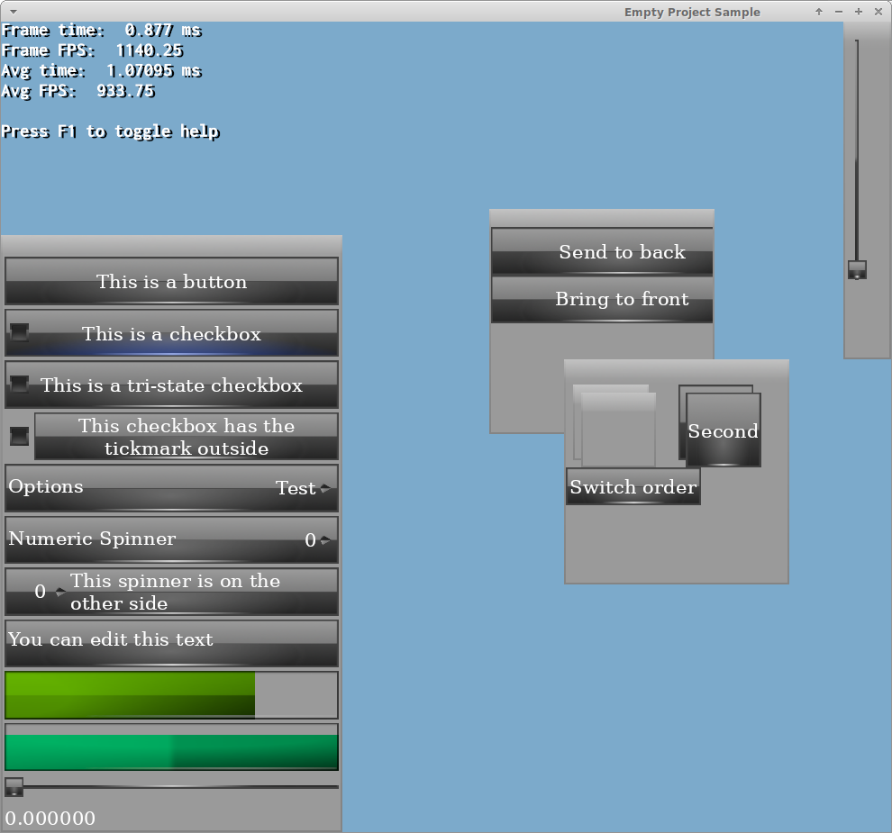

# Colibri Gui library

 * https://bitbucket.org/dark_sylinc/colibrigui/ (mercurial)
 * https://github.com/darksylinc/colibrigui/ (git)

We use [hg-git plugin](https://github.com/schacon/hg-git) to
interoperate between Mercurial & Git.

It's simple: I prefer Mercurial over Git
[a lot](http://www.yosoygames.com.ar/wp/2016/08/git-the-linux-kernel-and-other-projects/),
but I recognize Github's tools are superior (community, ticket system, pull requests)-

Any Pull Request or Ticket must be submitted to Github repo and must not break hg-git
interoperability (you have to do very weird git branch stuff to break it).

Originally this project was called "Crystal Gui", however googling around revealed this
name was already taken by something completely unrelated. To prevent clashing, it
was thus renamed to Colibri Gui, which doesn't seem to clash with anything at the
time of the rebrand.

# Cloning

This repo contains subrepos. Thus to clone it you'll need:

```
git clone --recurse-submodules --shallow-submodules https://github.com/darksylinc/colibrigui/
```

If you've already cloned then do:

```
git clone https://github.com/darksylinc/colibrigui/
git submodule update --init --recursive
```

If you're using hg-git, then make sure your [hgrc](https://www.mercurial-scm.org/doc/hgrc.5.html) file contains these lines:

```
[subrepos]
allowed = True
git:allowed = True
```

# Screenshots




# Goals

1. Be lightweight within reasonable expectations. Except for text rendering.
1. Text rendering dependencies: Be a library that has no or minimal external dependencies.
We perform text rendering using Freetype2 & HarfBuzz. Additionally these two depend on
ZLib. These libraries are being included and have been tuned with defaults to use our own
compiled versions, rather than system ones. The libraries are not using CoreText, Direct2D
nor any other OS-specific rendering implementation. This allows Colibri's text engine
to be used on virtually any platform (e.g. Linux, Windows, Mac, iOS, Android) in a
consistent manner, and without having to worry about ABI breakage.
1. Freetype2 depends on HarfBuzz (optional) to enhance auto hinting. But for that to work,
HarfBuzz must be compiled with Freetype2. That's a chicken and egg problem.
This can only solved if both libraries are static, or compiled as a single dll, or
compiled multiple times iteratively until both dependencies are met. We chose to go
for static libs.


# Missing text features and Limitations

1. CJK Top to Bottom: We support TTB, but some details like drawing 2-digit numbers at the
same height instead of two is not yet implemented.
1. Mixing Right to Left with Left to Right needs some testing
1. Right to Left strings in the Editbox may not be working as intended
1. LinebreakMode::WordWrap assumes space and tabs is what separate words, which is not
always true for all languages.

# Known issues

1. Mixing multiple font sizes into the same Label, the correct height for the newline
will not always be correctly calculated and thus be overestimated.


# How to build docs

You'll need:

1. CMake 3.9 or higher
1. Doxygen. `sudo apt install doxygen`

Create the CMake script and type: `ninja doxygen`

# FAQ

### Performance on Android is ultra slow

We stream font files from disk (rather than load them directly on memory) because CJK font files are huge.
However random `AAsset_seek` is very slow for compressed files.

To fix this problem disable compression for font files. In your build.gradle file add:

```
aaptOptions {
    noCompress 'ttf'
}
```

### Editboxes are not working on Android

See [Android Integration](Docs/AndroidIntegration) page

### Why did you write this library?

I've always wanted a GUI meant for video games that would fit the following criteria:

  * Is reasonably fast (i.e. doesn't make a huge impact when complex UIs are on screen).
    We don't aim to be the fastest one, but at least we shouldn't be a drag like most UIs
    are.
  * Has internationalization support
  * Open Source
  * Lightweight (in terms of memory consumption, lines of code, file sizes, build times)
  * Has builtin support for basic typing editboxes
  * Supports keyboard and mouse pointer navigation
  * Supports gamepad and similar devices (e.g. AppleTV's remote control)
  * Supports touch

None of the libraries I knew or tried met all of the criteria, so I decided to write one

Aside from international support, which is very important for me (Colibri supports arabic
and hebrew [RTL layouts](https://tech.trivago.com/2015/04/27/right-to-left/), RTL text,
chinese and japanese top-to-down-right-to-left text, and of course... CJK font support),
with Colibri I wrote the shader with performance in mind and a layout engine which works
very similar to wxWidgets.

In fact I can design my layouts in wxFormBuilder and then write them on Colibri's.

There were other reasons (one of my clients is VERY picky about UI alignment so the
layout engine solved me a lot of arguments with him. I wrote the layout engine with him in
mind).

Regarding performance: Aside that we try to use as fewer draw calls and state changes as
possible using modern rendering practices, we have a [breadth-first mode](https://github.com/darksylinc/colibrigui/blob/fe47825a9146846e3b655c301baaa4a413d86e6b/include/ColibriGui/ColibriWidget.h#L131) to
render efficiently a common UI pattern in games:

In games it's quite common to render a button, then a child image, then a button,
another child image, and so on. Imagine an inventory menu.

Typically the parent button is always the same, but the child is different
(uses different picture, material, or may be text which requires a different shader).
An UV atlas helps at this, but in my experience it doesn't help too much in real world cases.

Breadth first potentially sacrifices drawing correctness for speed, as it will draw
all parents first (e.g. all buttons first), then all children (first the images,
then the text or vice versa). This lets us draw everything in roughly 3 draw calls
(1 for the buttons, 1 for the icons assuming they share similar materials and the
same texture array, and 1 for the text.).

This works fine as long as the widgets rendered in breadth first are not overlapping.

I had a bone with most Text rendering solutions: Most solutions lack sharpness
(due to poor use of font atlases), and also lack rich text features like bolding,
italic, colouring, adding a shadow, adding an outline (ok Colibri doesn't support
outline either). In many cases you can do colour and shadow by hand using multiple
text elements (for shadows, create another text in black behind and displace it).
But Colibri lets you support all of this with just one ColibriLabel.

There's so many games with ilegible text out there. And then when customers complain
they can't increase the font size because it breaks the whole UI. In Colibri that
(mostly) doesn't happen thanks to the layout engine, which automatically resizes
everything.<br/>
The function "sizeToFit" from Labels have been inspired by Apple's UILabel.
In fact ColibriLabel was inspired by UILabel. It's such a good class.

One more element I needed is that I planned to use Colibri in a threaded environment
(render-split model to be exact. Logic thread needs to communicate with render thread
about UI state, render thread manages and owns the UI). It gets very hard to do that
right with a 3rd party library that sneakily decided to use a global variable, TLS,
or something else that would break in this environment.<br/>
Writing it myself ensures it will work.

Last but not least, I like pretty and glossy skins, and most UIs don't look pretty (IMO)
out of the box. This is purely on the artistic side. Windows 10 feels like a massive
step backwards from Windows 7 in that regard.

### Is this library just for video games?

While that is intended use, you don't have to. Any multimedia equipment that requires
basic navigation with a remote control could be suited for this. For example my old TV
has a built-in file explorer for opening movies and pictures in an USB drive.

This interface could use Colibri, as it was developed to be very fast and lightweight
displaying lots of big buttons with thumbnails on it and a text description.

### Why not use [Pango](https://www.pango.org/)?

Pango is LGPL-licensed software, which means it cannot be used in closed platforms such as
consoles or the App Store (iOS)

While we'd love to see these platforms opening up, the reality is that is very likely not
gonna happen and our core target market uses these platforms.

### What programming language is Colibri written?

Colibri is written in C++98. This ensures maximum compatibility with even old compilers,
and also very fast build times, since building with C++11 and afterwards often increases
build times.

### What's your memory consumption? Can you customize allocators?

No. Some C and hardcore C++ programmers may be in shock that we use the STL.
We try to minimize STL usage to the basics:

  * std::vector for most of our needs (which is basically a linear contiguous array)
  * std::string for text
  * Rarely use std::set and std::map when O(log N) is needed

GUI libraries are difficult to write, hence we use the STL for common operations to speed
up development.

We do not do dumb stuff like creating a temporary std::vector on the stack on functions
that are called every frame, as this would lead to allocs and deallocs every frame.
If such container is needed, we keep it persistently so that its memory can be reused.

If a container or snippet of code is allocating and deallocating memory every frame this
is a bug and feel free to report it.

I'm afraid we do not provide custom allocators.

I'm also afraid that each Widget/Control created is done via new, i.e.

```
Colibri::Button *retVal = new Colibri::Button( m_colibriManager );
```

This means each widget may not be contiguous. We may fix this in the future and provide
custom allocators for handling widgets, because after all, all widgets are created either
via:

  1. ColibriManager::_createWidget (creation)
  1. ColibriManager::destroyWidget (destruction)
  1. ColibriManager::createWindow (creation)
  1. ColibriManager::destroyWindow (destruction)
  1. ShaperManager::addShaper calls new
  1. ShaperManager::growAtlas calls realloc

So adding a custom allocator to handle the widgets & glyph rendering should be rather
easy.

Note however the widgets inside may allocate further memory e.g. via std::vector living
inside of them.

Text management is probably the biggest offender in terms of memory usage. In extreme
cases we need to convert the std::string (UTF8) into an icu::UnicodeString (UTF16).

The more widgets with text (or worst, editable text) the worst it gets. If this text
changes every frame, then it's possible you end up with memory allocations every frame.

### Do you use C++ Exceptions?

Colibri Gui not rely on C++ exceptions. However our Ogre3D backend does, and currently
that's the only backend.

### Do you use templates?

Aside from stl library, we only rely on templates when it makes sense to do so, and that
means almost never.

### How does Colibri render text?

There are several known ways to render text:

  1. Render via the font rasterization library i.e. FreeType directly into the screen.
     Consumes little memory. Best quality. It's CPU-only. It's terribly slow.
  1. Render the fonts with the GPU using clever GPU algorithms like the Loop-Blinn method
     or the Dobbie Method. [Slug](http://sluglibrary.com/) deserves a special mention as
     it renders everything via pixel shaders with exceptional high quality at high speed.
  1. Fixed font atlases. This is fine if you stick to latin characters, but quality
     suffers when the font size doesn't match the one in the atlas, and RAM consuption can
     go out of proportion for other languages.
  1. Signed Distance Fields. An significant improvement over fixed font atlases, but still
     has ultimately the same problems. These are popular among videogames because of its
     speed and reasonable quality, but it doesn't work as well for non-lating characters.
  1. Dynamic atlas. Generate the atlas on the demand based on characters and font sizes
     needed on screen, and cache them for reuse, and start throwing away what hasn't been
     used when we're running out of space.

For more information see Lengyel's [GPU Font Rendering Current State of the Art](http://terathon.com/font_rendering_sota_lengyel.pdf)

Colibri uses the last one i.e. a dynamic atlas. The difference with most implementations
is that they often use a 2D texture. This is troublesome because unless all glyphs have
the same width and height (spoiler alert: they don't) you run into the "sprite packing"
problem of packing all glyphs as tightly as possible.

This is a hard problem i.e. we either spend considerable time analyzing the optimal way
to place all the glyphs in the 2D atlas, or we use simple algorithms that will waste
a lot of RAM.

Colibri does not do that. We use a 1D buffer and store all glyphs contiguously. This turns
a 2D fragmentation problem into a 1D problem, which is **much** easier to handle and
resembles regular memory fragmentation which is well understood.

The glyph is then fetch from the pixel shader using the following code:
```
//GLSL
#define OGRE_BufferFetch1( buffer, intLocation ) texelFetch( buffer, intLocation ).x
//HLSL
#define OGRE_BufferFetch1( buffer, intLocation ) buffer.Load( intLocation ).x
//Metal
#define OGRE_BufferFetch1( buffer, intLocation ) buffer[(intLocation)]

glyphCol = OGRE_BufferFetch1( glyphAtlas, int( inPs.glyphOffsetStart +
						uint(floor(inPs.uvText.y) *
						float(inPs.pixelsPerRow) +
						floor(inPs.uvText.x)) ) );
```

This prevents HW bilinear filtering, but we do not care because **we render sharp
pixel-perfect fonts for the given font size / DPI selected**, that means for example our
dynamic atlas may contain the letter 'e' twice, one with font size 16 another with font
size 20.

### Why don't you use Slug?

Slug is not free.

### Why do you use FreeType instead of stb_truetype?

I was tempted by the extreme simplicity of stb_truetype over FreeType (largely on disk
size of both code and compiled library) but I was very limited in time and did not want to
spend time analyzing too much.

A quick google around showed that:

  * stb is mostly aimed at producing fixed font atlases (i.e. SDF atlas).
  * Apparently FreeType is faster at rasterizing than std_truetype. Although this may be
    old benchmarks, it would make sense since fixed font atlases are only built once. But
    this is not the case for dynamic atlas approaches like Colibri's, so rasterization
    time is very important.
  * Due to our internalization support goal, we need to support very weird / obscure
    formats. stb only supports the most popular ones.
  * FreeType is older and thus more tested against edge cases (i.e. non-latin fonts)

Admitedly these are all preconceptions rather than hard evidence (except the performance
benchmark, however it may be outdated), but I did not want to spend considerable time
comparing the two, and chosing stb_truetype was too risky if it ended up not suitable
for my needs.


Unicode mini-intro for contributors
===================================

Unicode is hard. But it's harder than it should be because there's a lot of misconceptions
and misinformation. To make it even harder, the technical reports from unicode.org are
far from user friendly.

This mini-intro is aimed at preventing you from making the common mistakes.

Asuming we're dealing with UTF-8, Unicode has several things you need to take in mind:

1. Glyph: graphical representation of a codepoint or a grapheme cluster.
1. Code unit: A unicode codeunit in UTF-8 correspond with a byte.
1. Code point: A codepoint is formed from one or more codeunits. For example the letter
'A' is represented by the codeunit '0x41' in UTF-8, while the kanji '漢' U+6F22 is
represented by the three-byte codeunit sequence 'E6 BC A2' in UTF-8.<br/>
**It is a common misconception to think that a codepoint is a character**. In UTF-32,
codepoint are the same as codeunits.
1. 'Grapheme cluster': A grapheme cluster is made from one or multiple code
points.
Grapheme clusters can be caused by multiple reasons:
	1. Precomposed characters vs decomposed: For example the character ö can be
  	written in two ways: its precomposed form ö or its decomposed form o + ¨
		* Precomposed ö codepoint U+00F6; codeunits C3 B6
		* Decomposed ö codepoints U+006F and U+0308; codeunits 6F CC 88<br/>
	Note that there can be more than two codepoints. For example the glyph ṓ is made
	up from 3 codepoints, but should be rendered as a single character
	1. Complex text layout: For example in arabic scripts, the same letter can be
	represented in three different ways, depending on whether the letter is at the
	start, in the middle or at the beginning of a word. This is only one such example.
	We rely on HarfBuzz library to perform Complex Text Layout for us. 

So what really counts as a "character" or "letter" is more accurately a grapheme cluster,
not a codepoint. We store the beginning of the cluster (i.e. the first codepoint) in a
string in ShapedGlyph::clusterStart

**Please note that:**

  1. A glyph may be made from multiple codepoints. This happens when the string is stored
     in its decomposed form and the font has a precomposed version i.e. ö U+006F U+0308
     is stored as o + ¨ but is often rendered as a single glyph.<br/>
     One glyph, one cluster, two codepoints.
  1. A single cluster may result in multiple glyphs! For example the letter पा is one
     cluster made up from codepoints U+092A and U+093E is stored decomposed, and several
     devangari fonts also render it as two glyphs: प + ा<br/>
     One cluster, two glyphs, two codepoints.

**More information:**

 * [Let’s Stop Ascribing Meaning to Code Points](https://manishearth.github.io/blog/2017/01/14/stop-ascribing-meaning-to-unicode-code-points/)
 * [Breaking Our Latin-1 Assumptions](https://manishearth.github.io/blog/2017/01/15/breaking-our-latin-1-assumptions/)
 * [Arabic Localization of a Game – Our Experience](https://forum.unity.com/threads/arabic-localization-our-experience.355100/)
 * [Precomposed Character - Wikipedia](https://en.wikipedia.org/wiki/Precomposed_character)
 * [Complex text layout - Wikipedia](https://en.wikipedia.org/wiki/Complex_text_layout)
 * [Using a Japanese IME](http://blog.gatunka.com/2009/09/12/using-a-japanese-ime/)
 * [IME Basics for Developers](http://blog.gatunka.com/2009/09/20/ime-basics-for-developers/)
